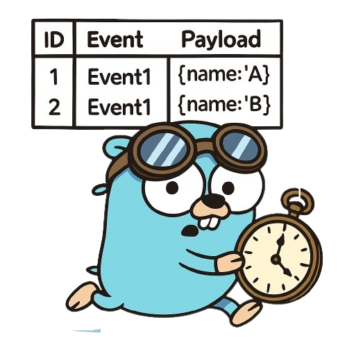

<div align="center">
    
    <h1>Chronicle</h1>
</div>

<div align="center">
  <h3 align="center">A pragmatic and type-safe toolkit for <br/>modern event sourcing in Go.</h3>
  <a href="mailto:andreisurugiu.tm@gmail.com"><i>Want to hire me?</i></a>
</div>

- [Quickstart](#quickstart)
- [What is event sourcing?](docs/what-is-event-sourcing.md)
- [Why event sourcing?](docs/why-event-sourcing.md)
- [Why not event sourcing?](docs/why-not-event-sourcing.md)
- [Optimistic Concurrency & Conflict Errors](docs/optimistic-concurrency/README.md)
	- [Handling conflict errors](docs/optimistic-concurrency/handling-conflict-errors.md)
	- [Retry with backoff](docs/optimistic-concurrency/retry-with-backoff.md)
	- [Custom retry](docs/optimistic-concurrency/custom-retry.md)
	- [How is this different from SQL transactions?](docs/optimistic-concurrency/sql-transactions-comparison.md)
	- [Will conflicts be a bottleneck?](docs/optimistic-concurrency/will-conflicts-be-a-bottleneck.md)
- [Snapshots](docs/snapshots/README.md)
	- [Snapshot policies](docs/snapshots/snapshot-policies.md)
- [Shared event metadata](docs/shared-event-metadata.md)
- [Ordering: Event log & Global event log](docs/ordering.md)
- [Storage backends](docs/storage-backends/README.md)
	- [Event logs](docs/storage-backends/event-logs.md)
	- [Snapshot stores](docs/storage-backends/snapshot-stores.md)
- [Event transformers](docs/event-transformers/README.md)
	- [Example: Crypto shedding for GDPR](docs/event-transformers/crypto-shedding-gdpr.md)
	- [Global Transformers with `AnyTransformerToTyped`](docs/event-transformers/global-transformers.md)
	- [Event versioning and upcasting](docs/event-transformers/event-versioning-upcasting.md)
- [Projections](docs/projections/README.md)
	- [`event.TransactionalEventLog` and `aggregate.TransactionalRepository`](docs/projections/transactional-event-log-and-repository.md)
	- [Example](docs/projections/example.md)
	- [Example with outbox](docs/projections/example-with-outbox.md)
	- [Synchronous Projections (`event.SyncProjection`)](docs/projections/synchronous-projections.md)
	- [Asynchronous Projections (`event.AsyncProjection`)](docs/projections/asynchronous-projections.md)
	- [Types of projections](docs/projections/types-of-projections.md)
- [Event deletion](docs/event-deletion/README.md)
	- [Event archival](docs/event-deletion/event-archival.md)
- [Implementing a custom `event.Log`](docs/custom-event-log/README.md)
	- [The `event.Reader` interface](docs/custom-event-log/event-reader.md)
	- [The `event.Appender` interface](docs/custom-event-log/event-appender.md)
	- [Global Event Log (the `event.GlobalReader` interface)](docs/custom-event-log/global-event-log.md)
	- [Transactional Event Log](docs/custom-event-log/transactional-event-log.md)
- [Implementing a custom `aggregate.Repository`](docs/custom-repository/README.md)
	- [Using an `aggregate.FusedRepo`](docs/custom-repository/fused-repo.md)
- [Contributing](docs/contributing/README.md)
	- [Devbox](docs/contributing/devbox.md)
	- [Automation](docs/contributing/automation.md)
	- [Workflow](docs/contributing/workflow.md)
- [How the codebase is structured](docs/codebase-structure/README.md)
	- [Core Packages](docs/codebase-structure/core-packages.md)
	- [Pluggable Implementations](docs/codebase-structure/pluggable-implementations.md)
	- [Package Dependencies](docs/codebase-structure/package-dependencies.md)
	- [Testing](docs/codebase-structure/testing.md)
- [Benchmarks](docs/benchmarks.md)
- [Acknowledgements](docs/acknowledgements.md)
- [TODO](docs/todo.md)


## Quickstart

> [!WARNING]
> I recommend going through the quickstart, since all examples use the `Account` struct used below from the `account` package.

Install the library
```sh
go get github.com/DeluxeOwl/chronicle

# for debugging
go get github.com/sanity-io/litter
```

Define your aggregate and embed `aggregate.Base`. This embedded struct handles the versioning of the aggregate for you.

We'll use a classic yet very simplified bank account example:
```go
package account

import (
	"errors"
	"fmt"
	"time"

	"github.com/DeluxeOwl/chronicle/aggregate"
	"github.com/DeluxeOwl/chronicle/event"
)

type Account struct {
	aggregate.Base
}
```

Declare a type for the aggregate's ID. This ID type **MUST** implement `fmt.Stringer`. You also need to add an `ID()` method to your aggregate that returns this ID.

```go
type AccountID string

func (a AccountID) String() string { return string(a) }

type Account struct {
	aggregate.Base

	id AccountID
}

func (a *Account) ID() AccountID {
	return a.id
}
```

Declare the event type for your aggregate using a sum type (we're also using the [go-check-sumtype](https://github.com/alecthomas/go-check-sumtype) linter that comes with [golangci-lint](https://golangci-lint.run/)) for type safety:
```go
//sumtype:decl
type AccountEvent interface {
	event.Any
	isAccountEvent()
}
```

Now declare the events that are relevant for your business domain.

The events **MUST** be side effect free (no i/o).
The event methods (`EventName`, `isAccountEvent`) **MUST** have pointer receivers:

```go
// We say an account is "opened", not "created"
type accountOpened struct {
	ID         AccountID `json:"id"`
	OpenedAt   time.Time `json:"openedAt"`
	HolderName string    `json:"holderName"`
}

func (*accountOpened) EventName() string { return "account/opened" }
func (*accountOpened) isAccountEvent()   {}
```

By default, events are encoded to JSON (this can be changed when you configure the repository).

To satisfy the `event.Any` interface (embedded in `AccountEvent`), you must add an `EventName() string` method to each event.

Let's implement two more events:

```go
type moneyDeposited struct {
	Amount int `json:"amount"` // Note: In a real-world application, you would use a dedicated money type instead of an int to avoid precision issues.
}

// ⚠️ Note: the event name is unique
func (*moneyDeposited) EventName() string { return "account/money_deposited" }
func (*moneyDeposited) isAccountEvent()   {}

type moneyWithdrawn struct {
	Amount int `json:"amount"`
}

// ⚠️ Note: the event name is unique
func (*moneyWithdrawn) EventName() string { return "account/money_withdrawn" }
func (*moneyWithdrawn) isAccountEvent()   {}
```


You must now "bind" these events to the aggregate by providing a constructor function for each one. This allows the library to correctly decode events from the event log back into their concrete types.

You need to make sure to create a constructor function for each event:

```go
func (a *Account) EventFuncs() event.FuncsFor[AccountEvent] {
	return event.FuncsFor[AccountEvent]{
		func() AccountEvent { return new(accountOpened) },
		func() AccountEvent { return new(moneyDeposited) },
		func() AccountEvent { return new(moneyWithdrawn) },
	}
}
```

Let's go back to the aggregate, and define the fields relevant to our business domain (these fields will be populated when we replay the events):
```go
type Account struct {
	aggregate.Base

	id AccountID

	openedAt   time.Time
	balance    int // we need to know how much money an account has
	holderName string
}
```

Now we need a way to build the aggregate's state from its history of events. This is done by "replaying" or "applying" the events to the aggregate.
You shouldn't check business logic rules here, you should just recompute the state of the aggregate.

We'll enforce business rules in commands. 

Note that the event structs themselves are unexported. All external interaction with the aggregate should be done via commands, which in turn generate and record events.

```go
func (a *Account) Apply(evt AccountEvent) error {
	switch event := evt.(type) {
	case *accountOpened:
		a.id = event.ID
		a.openedAt = event.OpenedAt
		a.holderName = event.HolderName
	case *moneyWithdrawn:
		a.balance -= event.Amount
	case *moneyDeposited:
		a.balance += event.Amount
	default:
		return fmt.Errorf("unexpected event kind: %T", event)
	}
	return nil
}
```

This is type safe with the `gochecksumtype` linter.

If you didn't add any cases, you'd get a linter error:
```
exhaustiveness check failed for sum type "AccountEvent" (from account.go:24:6): missing cases for accountOpened, moneyDeposited, moneyWithdrawn (gochecksumtype)
```

Now, let's actually interact with the aggregate: what can we do with it? what are the **business operations** (commands)?

We can **open an account**, **deposit money** and **withdraw money**.

Let's start with opening an account. This will be a "factory function" that creates and initializes our aggregate.

First, we define a function that returns an empty aggregate, we'll need it later and in the constructor:
```go
func NewEmpty() *Account {
	return new(Account)
}
```

And now, opening an account, and let's say **you can't open an account on a Sunday** (as an example of a business rule):
```go
func Open(id AccountID, currentTime time.Time, holderName string) (*Account, error) {
	if currentTime.Weekday() == time.Sunday {
		return nil, errors.New("sorry, you can't open an account on Sunday ¯\\_(ツ)_/¯")
	}
	// ...
}
```

We need a way to "record" this event, for that, we declare a helper, unexported method that uses `RecordEvent` from the `aggregate` package:
```go
func (a *Account) recordThat(event AccountEvent) error {
	return aggregate.RecordEvent(a, event)
}
```

Getting back to `Open`, recording an event is now straightforward:
```go
func Open(id AccountID, currentTime time.Time, holderName string) (*Account, error) {
	if currentTime.Weekday() == time.Sunday {
		return nil, errors.New("sorry, you can't open an account on Sunday ¯\\_(ツ)_/¯")
	}

	a := NewEmpty()

	// Note: this is type safe, you'll get autocomplete for the events
	if err := a.recordThat(&accountOpened{
		ID:         id,
		OpenedAt:   currentTime,
		HolderName: holderName,
	}); err != nil {
		return nil, fmt.Errorf("open account: %w", err)
	}

	return a, nil
}
```

Let's add the other commands for our domain methods - I usually enforce business rules here:
```go
func (a *Account) DepositMoney(amount int) error {
	if amount <= 0 {
		return errors.New("amount must be greater than 0")
	}

	return a.recordThat(&moneyDeposited{
		Amount: amount,
	})
}
```

And withdrawing money:
```go
// Returns the amount withdrawn and an error if any
func (a *Account) WithdrawMoney(amount int) (int, error) {
	if a.balance < amount {
		return 0, fmt.Errorf("insufficient money, balance left: %d", a.balance)
	}

	err := a.recordThat(&moneyWithdrawn{
		Amount: amount,
	})
	if err != nil {
		return 0, fmt.Errorf("error during withdrawal: %w", err)
	}

	return amount, nil
}
```

That's it, it's time to wire everything up.

We start by creating an event log. For this example, we'll use a simple in-memory log, but other implementations (sqlite, postgres etc.) are available.
```go
package main

import (
	"context"
	"fmt"
	"time"

	"github.com/DeluxeOwl/chronicle"
	"github.com/DeluxeOwl/chronicle/eventlog"
	"github.com/DeluxeOwl/chronicle/examples/internal/account"
	"github.com/sanity-io/litter"
)

func main() {
	// Create a memory event log
	memoryEventLog := eventlog.NewMemory()
	//...
}
```

We continue by creating the repository for the accounts:
```go
	accountRepo, err := chronicle.NewEventSourcedRepository(
		memoryEventLog,  // The event log
		account.NewEmpty, // The constructor for our aggregate
		nil,             // This is an optional parameter called "transformers"
	)
	if err != nil {
		panic(err)
	}
```

We create the account and interact with it
```go
	// Create an account
	acc, err := account.Open(AccountID("123"), time.Now(), "John Smith")
	if err != nil {
		panic(err)
	}
	
	// Deposit some money
	err = acc.DepositMoney(200)
	if err != nil {
		panic(err)
	}
	
	// Withdraw some money
	_, err = acc.WithdrawMoney(50)
	if err != nil {
		panic(err)
	}
```

And we use the repo to save the account:
```go
	ctx := context.Background()
	version, committedEvents, err := accountRepo.Save(ctx, acc)
	if err != nil {
		panic(err)
	}
```

The repository returns the new version of the aggregate, the list of committed events, and an error if one occurred. The version is also updated on the aggregate instance itself and can be accessed via `acc.Version()` (this is handled by `aggregate.Base`)

An aggregate starts at version 0. The version is incremented for each new event that is recorded.

Printing these values gives:
```go
	fmt.Printf("version: %d\n", version)
	for _, ev := range committedEvents {
		litter.Dump(ev)
	}
```

```go
❯ go run examples/1_quickstart/main.go
version: 3
&main.accountOpened{
  ID: "123",
  OpenedAt: time.Time{}, // Note: litter omits private fields for brevity
  HolderName: "John Smith",
}
&main.moneyDeposited{
  Amount: 200,
}
&main.moneyWithdrawn{
  Amount: 50,
}
```

You can find this example in [./examples/1_quickstart](./examples/1_quickstart).
You can find the implementation of the account in [./examples/internal/account/account.go](./examples/internal/account/account.go).

**Note:** you will see an additional `accountv2` package that is 95% identical to the `account` package + shared event metadata. You can ignore this package as most examples assume the `account` package. You can find more info in the [Shared event metadata section](docs/shared-event-metadata.md).
